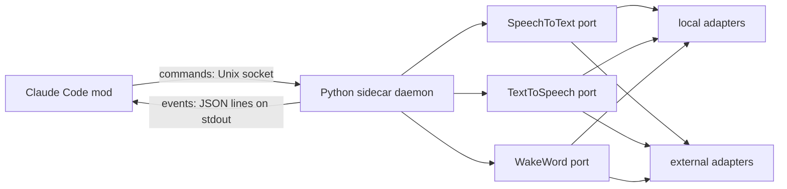

# claude-voice-mod

An always-open voice channel for Claude Code: you speak, Claude answers aloud, and the speech stack runs locally by default.

Status: pre-alpha, not installable yet. See [issue 0001](docs/issues/0001-the-repository-skeleton-the-sidecar-toolchain-and-the-ci-gates-are-green-with-no-voice-behavior-yet.md) and [ADR 0001](docs/adr/0001-a-claude-code-mod-drives-a-python-sidecar-daemon-that-holds-the-audio-over-a-json-lines-event-stream-and-a-unix-socket-command-channel-with-speech-providers-behind-ports.md).

## Architecture

## Development

| What | Command |
|---|---|
| Sidecar lint, format, types, tests | `cd sidecar && uv run ruff check && uv run ruff format --check && uv run mypy && uv run pytest` |
| TTS bench: speak one sentence in every voice and time it (`--voice provider:voice`, `--text`, `--no-play`); run it outside a sandbox, where `say` and the speaker work | `cd sidecar && uv run voice-sidecar bench tts` |
| Kokoro voices (pf_dora, pm_alex) in the bench: install the optional extra (its phonemizer and espeak-ng are GPL), then fetch the model files; without them each Kokoro row is skipped with the command to fix it | `cd sidecar && uv sync --extra kokoro && uv run voice-sidecar models fetch kokoro` |
| Piper voices (faber, cadu, jeff) in the bench: install the optional extra (piper-tts is GPL-3.0-or-later), then fetch the model files; without them each Piper row is skipped with the command to fix it | `cd sidecar && uv sync --extra piper && uv run voice-sidecar models fetch piper` |
| Plugin manifest and marketplace | `claude plugin validate .` |
| Quality gate | `se-gates check` |
| Docs gate | `living-docs check docs` |

## License

MIT, see [LICENSE](LICENSE).
