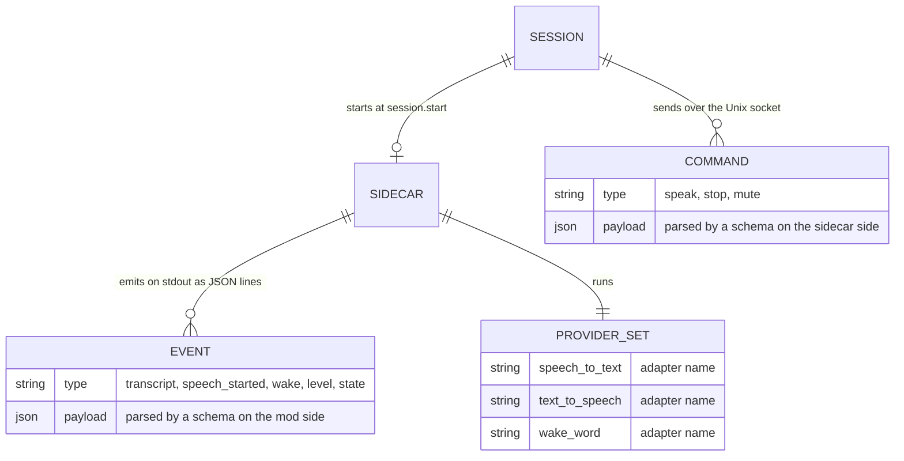

# claude-voice-mod Constitution

## Product

claude-voice-mod is a Claude Code mod that holds a spoken conversation with the session over an always-open channel, like the voice mode of the Codex CLI: the owner speaks, the transcript becomes the prompt, and the reply is spoken back. It serves the owner's Claude Code sessions on macOS, in Brazilian Portuguese first.

## Scope Boundaries

**In scope:**

- A mod that starts a Python sidecar at session start, submits each transcript as the owner's prompt and speaks the reply.
- Speech-to-text, text-to-speech and wake-word detection, each behind a port, with the provider chosen by configuration.
- Local providers by default; external providers (OpenAI, ElevenLabs, Deepgram) as optional adapters that run only when configured with a key.
- Benches that let the owner compare the voices and the transcription models on this machine.
- A status band above the prompt: the channel state, the microphone level, the active providers and the last transcript.

**Explicitly out of scope:**

- Platforms other than macOS on Apple silicon.
- A speech engine or model of our own; the project wires existing ones.
- Sending audio or text to an external service the owner did not configure.
- Harnesses other than Claude Code.

**Phase boundaries:**

- Phase 1: the skeleton, the TTS bench and the STT bench (issues 0001 to 0003). No conversation yet.
- Phase 2: the open channel in the mod, then the wake word, barge-in and tool narration (issues 0004 and 0005).

## Data Model / Schema Foundation

One session starts at most one sidecar. The sidecar runs exactly one adapter per port at a time. Every event and every command crosses the process boundary as JSON and is parsed by a schema on the receiving side before use.

## Non-negotiables

- Audio capture and playback live only in the sidecar; the mod never touches the microphone or the speaker.
- With no configuration, every port runs a local adapter and no audio or text leaves the machine.
- An external adapter reads its key only from the environment; no key is written to a file of this repository or to the mod's settings.
- Every message crossing the mod–sidecar boundary is parsed by a schema; a type comes from the parse, never from a cast.
- All artifacts (code, comments, docs) are in English. Diagrams are Mermaid.

## Amendment Log

Amendments are appended here as `## Amendment N — YYYY-MM-DD: summary`; the sections above are not edited once ratified.

## Amendment 1 — 2026-10-07: a latency budget

Responsiveness is a non-negotiable, set by the owner. From the end of the owner's utterance to the first audible word of the reply, the target is under 1.5 s on this machine with the local default providers; the sidecar's own stages (end-of-speech detection, transcription, and synthesis of the first sentence) get 500 ms of it, the rest belongs to the model's first sentence. The sidecar emits the time of each stage as events, so the budget is measured on every turn, never estimated; a change that adds to a measured stage states the before and after numbers. The reply is spoken sentence by sentence as it streams, never after it completes.
